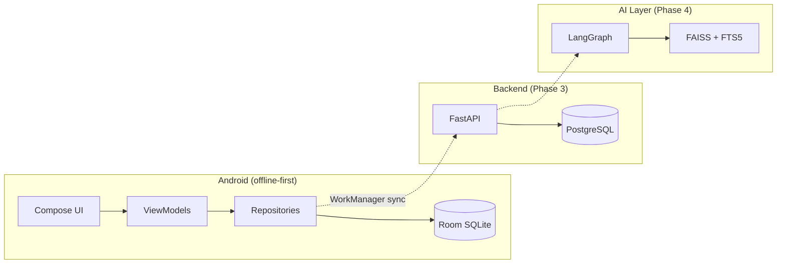

# Forged

**A personal, offline-first gym tracker — every Progression Pro feature, no paywall.**

Forged is a precision workout logging app for Android with a molten-forge design language, local analytics, and a planned cloud + AI coaching layer. Built for one lifter, free forever.

<p align="center">
  <a href="https://github.com/AyoubAZIAMIMER/Gym-Tracking-Android-App/stargazers">
    
  </a>
  <a href="https://github.com/AyoubAZIAMIMER/Gym-Tracking-Android-App/forks">
    
  </a>
  
  
</p>

---

## Tech Stack

<p align="center">
  <a href="https://skillicons.dev">
    
  </a>
</p>

### Android (live)

<p>
  
  
  
  
  
  
  
  
  
  
  
  
  
  
</p>

### Backend (Phase 3 — scaffolded)

<p>
  
  
  
  
  
  
</p>

### AI coaching (Phase 4 — planned)

<p>
  
  
  
  
</p>

---

## Features

| Area | Highlights |
|------|------------|
| **Workout session** | Pre-filled sets, drag-adjust weight/reps, set tags, supersets, rest timer bubble + notification, plate calculator, live PR detection |
| **Library** | 100+ exercises, muscle-target figures, demo photos, custom exercise CRUD, Progression import |
| **History** | Calendar heatmap, workout log, PR stars, repeat workout |
| **Stats** | e1RM trends, weekly volume, plateau detection, PR timeline, training calendar |
| **Recovery** | Per-muscle freshness map with body figures |
| **Programs** | PPL / Upper-Lower / Bro Split templates, multi-day program editor |
| **Data** | Progression `.pgnbkp` import, JSON + CSV export, profile setup |

> No subscriptions. No premium tier. No on-device ML. AI coaching arrives in Phase 4 as an opt-in tab.

---

## Star History

<p align="center">
  <a href="https://star-history.com/#AyoubAZIAMIMER/Gym-Tracking-Android-App&Date">
    <picture>
      <source media="(prefers-color-scheme: dark)" srcset="https://api.star-history.com/svg?repos=AyoubAZIAMIMER/Gym-Tracking-Android-App&type=Date&theme=dark" />
      <source media="(prefers-color-scheme: light)" srcset="https://api.star-history.com/svg?repos=AyoubAZIAMIMER/Gym-Tracking-Android-App&type=Date" />
      
    </picture>
  </a>
</p>

<p align="center">
  <a href="https://github.com/AyoubAZIAMIMER/Gym-Tracking-Android-App">
    
  </a>
</p>

---

## Project Structure

```
Gym-Tracking-Android-App/
├── android/                 # Kotlin + Jetpack Compose app
│   └── app/src/main/java/com/gymtracker/
│       ├── data/            # Room DB, repositories, importers
│       ├── domain/          # Analytics engine (pure Kotlin)
│       ├── ui/              # Screens, components, theme, motion
│       ├── service/         # Rest timer foreground service
│       └── utils/           # 1RM, plate calc, formatting
├── backend/                 # FastAPI scaffold (Phase 3)
├── design/                  # Motion design system (MOTION.md)
├── exercises_db/            # Exercise catalog assets
├── docker-compose.yml       # Postgres + API (Phase 3)
├── AGENTS.md                # Agent / contributor constraints
└── MEMORY.md                # Living project state
```

---

## Getting Started

### Prerequisites

- **JDK 17**
- **Android SDK 35** (API 26+ devices supported)
- Android Studio Ladybug or newer (recommended)

### Build & run

```bash
cd android
./gradlew assembleDebug
```

Install the APK on a device or emulator:

```bash
adb install app/build/outputs/apk/debug/app-debug.apk
```

> After large dependency bumps, run `./gradlew clean` first — incremental dexing can mix Compose versions and crash at launch.

### Import your data

1. Open **Data** from the Home screen gear icon.
2. Import a **Progression** `.pgnbkp` backup.
3. Optionally run **Name imported exercises (CSV)** with a Progression CSV export for full exercise names.

---

## Architecture



| Phase | Status | Scope |
|-------|--------|-------|
| **1** | In progress | Android MVP — logging, history, programs, import/export |
| **2** | Partial | Local analytics — charts, PRs, plateau, calendar heatmap |
| **3** | Scaffolded | FastAPI + PostgreSQL sync, cloud backup |
| **4** | Planned | LangGraph coaching agent, streaming chat, cached cards |

---

## Design

Forged uses the **Molten Forge** identity — ember orange on charcoal iron, Anton display type, liquid-glass surfaces (Haze blur), and a motion system built around steel-like physics (see `design/MOTION.md`).

---

## Contributing

This is a personal project built for a single owner. Issues and ideas are welcome, but the roadmap follows `MEMORY.md` phase gates — Phase N must pass manual testing before Phase N+1 begins.

---

<p align="center">
  <strong>The forge is hot.</strong><br/>
  <sub>Package: <code>com.gymtracker</code> · Display name: <strong>Forged</strong> · v0.1.0</sub>
</p>
